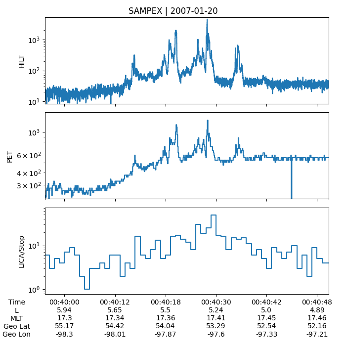
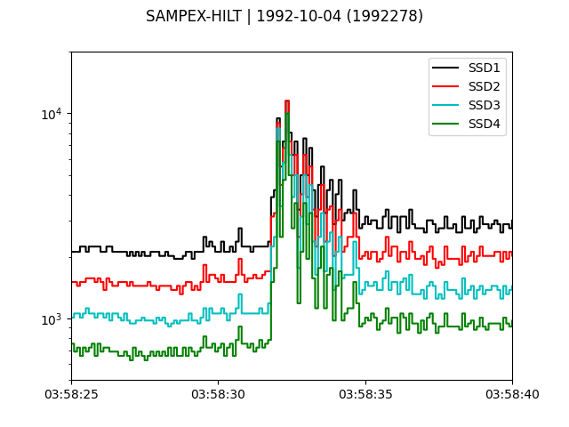

========
Examples
========

This example gallery using the best practices and illustrates functionality throughout `sampex`. 

Command line to plot the SAMPEX data
^^^^^^^^^^^^^^^^^^^^^^^^^^^^^^^^^^^^
`sampex` includes a relatively simple command line script to plot the data from all three instruments.

.. code:: bash

    plot_sampex 2007 1 20 --yscale log

Load and plot the HILT state 1 data
^^^^^^^^^^^^^^^^^^^^^^^^^^^^^^^^^^^
This example shows the microburst isotropy that was reported by Blake et al. 1996 "New high temporal and spatial resolution measurements by SAMPEX of the precipitation of relativistic electrons".

.. code:: python

    from datetime import datetime

    import matplotlib.pyplot as plt

    import sampex

    day = datetime(1992, 10, 4)

    h = sampex.HILT(day)
    h.load()

    fig, ax = plt.subplots()
    colors = ['k', 'r', 'c', 'g']
    for i, color in enumerate(colors, start=1):
        ax.step(h["time"], h[f"SSD{i}"], label=f"SSD{i}", where="post", c=color)
    ax.legend()
    ax.set_yscale('log')
    ax.set_xlim(
        datetime(1992, 10, 4, 3, 58, 25), 
        datetime(1992, 10, 4, 3, 58, 40)
        )
    ax.set_ylim(500, None)
    plt.suptitle(f"SAMPEX-HILT | {day.date()} ({sampex.date2yeardoy(day)})")
    plt.show()

Load and plot the HILT state 4 data
^^^^^^^^^^^^^^^^^^^^^^^^^^^^^^^^^^^

.. code:: python

    >>> from datetime import datetime
 
    >>> import matplotlib.pyplot as plt
 
    >>> import sampex
 
    >>> day = datetime(1998, 8, 17)
 
    >>> h = sampex.HILT(day)
    >>> h.load()
 
    >>> fig, ax = plt.subplots()
    >>> ax.step(h['time'], h['counts'], label='HILT', where='post')
    >>> ax.set_xlim(
            datetime(1998, 8, 17, 20, 57, 0),
            datetime(1998, 8, 17, 20, 57, 58)
        )
    >>> ax.set_yscale('log')
    >>> plt.suptitle(f'SAMPEX-HILT | {day.date()}')
    >>> plt.show()

Load and plot the PET data
^^^^^^^^^^^^^^^^^^^^^^^^^^
.. code:: python

    >>> from datetime import datetime

    >>> import matplotlib.pyplot as plt

    >>> import sampex

    >>> day = datetime(2007, 1, 20)

    >>> p = sampex.PET(day)
    >>> p.load()

    >>> fig, ax = plt.subplots()
    >>> ax.step(p['time'], p['counts'], label='PET', where='post')
    >>> plt.suptitle(f'SAMPEX-PET | {day.date()}')
    >>> plt.show()

Load and plot the LICA data
^^^^^^^^^^^^^^^^^^^^^^^^^^^

.. code:: python

    >>> from datetime import datetime

    >>> import matplotlib.pyplot as plt

    >>> import sampex

    >>> day = datetime(2007, 1, 20)

    >>> l = sampex.LICA(day)
    >>> l.load()

    >>> fig, ax = plt.subplots()
    >>> ax.step(l['time'], l['stop'], label='PET', where='post')
    >>> plt.suptitle(f'SAMPEX-LICA (stop) | {day.date()}')
    >>> plt.show()

Load and plot the Attitude data
^^^^^^^^^^^^^^^^^^^^^^^^^^^^^^^

.. code:: python

    >>> from datetime import datetime

    >>> import matplotlib.pyplot as plt

    >>> import sampex

    >>> day = datetime(2007, 1, 20)

    >>> a = sampex.Attitude(day)
    >>> a.load()

    >>> fig, ax = plt.subplots()
    >>> ax.plot(a['time'], a['Altitude'], label='SAMPEX Altitude')
    >>> plt.suptitle(f'SAMPEX Altitude | {day.date()}')
    >>> plt.show()

Merge the HILT and Attitude data
^^^^^^^^^^^^^^^^^^^^^^^^^^^^^^^^
Most often you'll need to put the instrument data in context. Here the context is the attitude data. This short example shows how you can merge the HILT and Attutude data together.

.. note::
    This example does not interpolate the attitude data, it only finds the nearest attitude timestamps within 3 seconds (the attitude data is reported every 6 seconds). This works well for many applications.

.. code:: python

    >>> from datetime import datetime

    >>> import pandas as pd

    >>> import sampex

    >>> day = datetime(2007, 1, 20)
    
    >>> hilt = sampex.HILT(day)
    >>> hilt.load()
    >>> att = sampex.Attitude(day)
    >>> att.load()

    >>> merged = pd.merge_asof(hilt.data, att.data, left_index=True, right_index=True,
        tolerance=pd.Timedelta(seconds=3), direction='nearest')

    >>> merged
                            counts  GEO_Radius  GEO_Long  GEO_Lat  Altitude   L_Shell       MLT  Mirror_Alt      Pitch  Att_Flag
    2007-01-20 00:00:02.000     0.0     6871.65   99.1309 -29.9071   498.851   1.86972   5.81077     565.516 -9999.9000   -9999.0
    2007-01-20 00:00:02.020     4.0     6871.65   99.1309 -29.9071   498.851   1.86972   5.81077     565.516 -9999.9000   -9999.0
    2007-01-20 00:00:02.040     1.0     6871.65   99.1309 -29.9071   498.851   1.86972   5.81077     565.516 -9999.9000   -9999.0
    2007-01-20 00:00:02.060     1.0     6871.65   99.1309 -29.9071   498.851   1.86972   5.81077     565.516 -9999.9000   -9999.0
    2007-01-20 00:00:02.080     1.0     6871.65   99.1309 -29.9071   498.851   1.86972   5.81077     565.516 -9999.9000   -9999.0
    ...                         ...         ...       ...      ...       ...       ...       ...         ...        ...       ...
    2007-01-21 00:00:03.900     6.0     6795.27 -140.9640  80.5842   437.949  41.72010  10.81660     700.022   174.9714       0.0
    2007-01-21 00:00:03.920     3.0     6795.27 -140.9640  80.5842   437.949  41.72010  10.81660     700.022   174.9714       0.0
    2007-01-21 00:00:03.940     5.0     6795.27 -140.9640  80.5842   437.949  41.72010  10.81660     700.022   174.9714       0.0
    2007-01-21 00:00:03.960     6.0     6795.27 -140.9640  80.5842   437.949  41.72010  10.81660     700.022   174.9714       0.0
    2007-01-21 00:00:03.980    10.0     6795.27 -140.9640  80.5842   437.949  41.72010  10.81660     700.022   174.9714       0.0

    [4320000 rows x 10 columns]